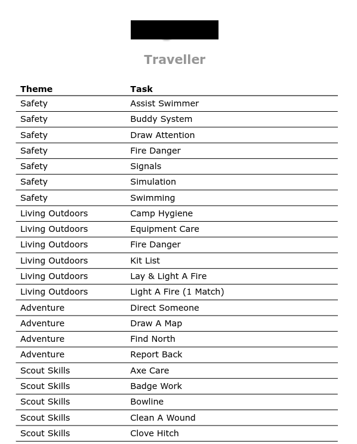

# Scouts Digital Utilities 🛠️

> [!NOTE]  
> I'm putting this tool out there in the hopes that it's helpful to someone else. I don't really have time to polish into something usable beyond a commandline tool right now. I was hoping to either make it a webapp or a downloadable GUI but alas. If you want to contribute or change anything, feel free to make a PR.

This repo is a quick command-line wrapper around some hacky python code I wrote to parse scouts digital data into more human- (or computer-) friendly formats. I make no guarantees any of this works beyond my machine (classic).

## Installation

I use uv for installation. You'll need to [install that first](https://docs.astral.sh/uv/). Life is too short to do anything otherwise:

```
uv tool install git+https://github.com/dlejeune/sd-utils
```

Otherwise you can download the repo and install all the dependencies but if you know how to do that then I guess you can figure out the rest. 

### Dependencies

The bane of everyone's existence. One of the tools (the todo-list generator) requires a functional version of XeLaTeX. This is not the simplest thing to get working but there exist a few tutorials out there. Check here: [https://www.tug.org/texlive/]

## Usage

When you install with uv, you get the command line tool `sd-utils`. Running `sd-utils --help` should provide an overview of the tool. 

In a nutshell, there are two main sub-commands: `make-adv-chart` and `make-todo-list`. These produce nicely-formatted advancement charts and todo lists respectively. They both consume the advancement chart export from scouts digital. In theory, you can provide it with the "minimal" export, but I sugest just doing a full export.

## Outputs
For the advancement charts, this tool converts the SD output into a printable chart broken down by patrol:


The todo utility produces a simple table for each scout containing their **unfinished tasks** for a level (or mutliple levels):


